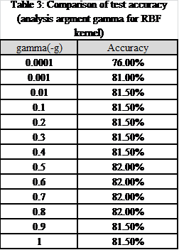

## 关于工程

本工程使用LibSVM对风景与建筑图片进行分类。很早之前做的了，突然找到，原为本科图像处理课的作业，整理之后放在这里。`.docx`包括了SVM的原理，参数优化方法。

## Code File Discription

1. main.m  主调用模块
2. cross_validation.m 交叉验证
3. eval_func.m        评估函数
4. eval_predict.m     使用自定义的评估函数进行SVM预测
5. extractfeature.m   特征提取
6. svm_girdsearch.m   格点搜索
7. ./libsvm-3.17      libsvm matlab格式工具包，已在32bit机上编译，在64位机上进入libsvm-3.17/matlab目录使用make重新编译
8. data.mat           已提取特征后的保存数据，减少每次都从头读取图片的麻烦

NOTES:原始数据文件默认存放在images目录下，包括manmade和nature文件夹

## About me
xiahouzuoxin
2014.01.05
